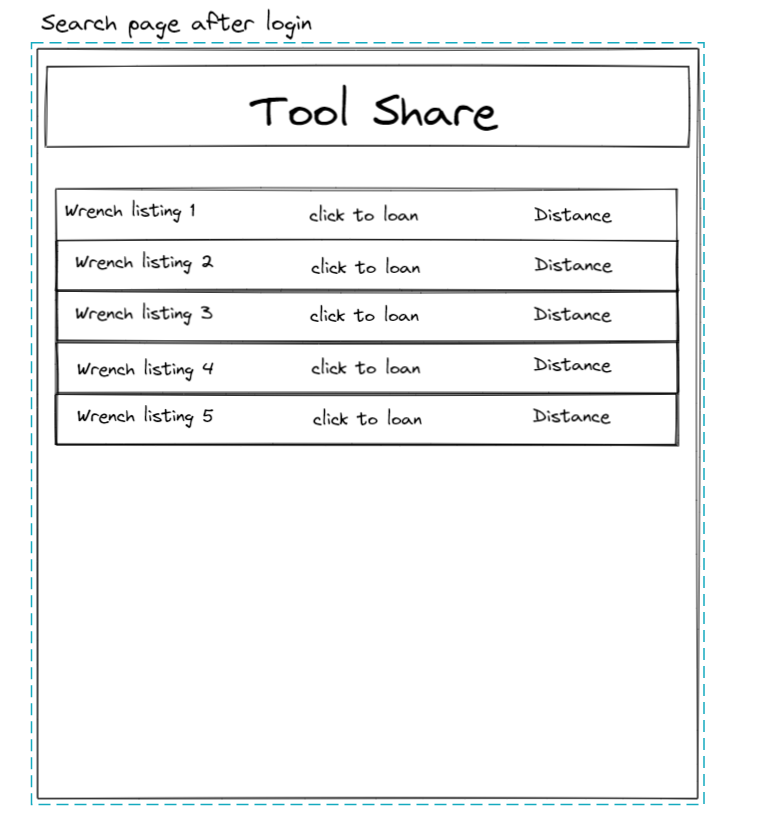

# Tool Share
## Contributors
- Hambalieu Jallow
- Kevin LaMarca
- Johsua McCluskey
- Shane Roach
## Description
Tool Share is an app sharing platform where users can find and share tools within their city.
### User Stories
- As a tool owner, I want the ability to advertise spare tools, so that other people can borrow them.
- As a person in need of a tool, I want the ability to search for a tool, and be provided the closest tool lender within my location search vicinity, so that I can complete the project I am working on and not need to buy another tool from the store.
- As a person with limited space within my apartment, I want to be able to borrow tools from people in my area, so that I dont have find a place to store them once my need of them is finished.
- As a person interested in sustainability, I want to alleviate stress on the consumer chain by borrowing rather than purchasing new tools that will inevitably be used very little.
- As a person interested in providing oppurtunities for connection, I want to build community by sharing resources, so that new relatationships can be established and stronger communities are built.
### Minimal Viable Product
- User can create account
- Users can search for a preset list of tools and be provided with a list of current tools which are filtered by the closest location to the user.
- User can create a loaner tool listing.
- Users can borrow tools from other users.
- Users will be provided the distance between each user in order to establish a meeting point.
### Stretch Goals
- Test implementation to populate a database with users and tools.
- Users can chat with each other to ask questions or find a meeting location.
- Users are provided with suggestions on meetup locations.
- Users can leave reviews and ratings on different users accounts.
- Users can upload images of their tools.
- Filter by other parameters for tool sort.
- Transaction exchange between objects.

### WireFrame

### Database Schema

### Domain Modeling

[Team Agreement](https://docs.google.com/document/d/1ryQMBuH6gXrHrxLx_NkCaN7Azr95d7lRyIM4f-5L_vY/edit?usp=sharing)

[Trello](https://trello.com/b/lMQDnfwi/tool-share)
